# 📦 Projet Mangasa – Documentation Technique Complète

> **Mangasa** est un système de gestion logistique développé pour l'entreprise **EMASE** (Entreprise Malienne de Services et d'Entreposage). Il permet de gérer les stockages, les trafics, la facturation, les transitaires et l'administration d'un entrepôt portuaire.

---

## Table des matières

1. [La Stack Technique (VILT)](#1-la-stack-technique-vilt)
2. [Comment Inertia.js fonctionne – Le cœur du système](#2-comment-inertiajs-fonctionne--le-cœur-du-système)
3. [Architecture globale du projet](#3-architecture-globale-du-projet)
4. [Le cycle de vie d'une requête](#4-le-cycle-de-vie-dune-requête)
5. [Structure des fichiers détaillée](#5-structure-des-fichiers-détaillée)
6. [Le Layout System – Comment les pages sont assemblées](#6-le-layout-system--comment-les-pages-sont-assemblées)
7. [Les Composants créés en détail](#7-les-composants-créés-en-détail)
8. [Les Pages créées en détail](#8-les-pages-créées-en-détail)
9. [Les Routes – Backend et Frontend](#9-les-routes--backend-et-frontend)
10. [Le Design System (Typographie)](#10-le-design-system-typographie)
11. [Intégration du thème Riho](#11-intégration-du-thème-riho)
12. [Commandes pour lancer le projet](#12-commandes-pour-lancer-le-projet)
13. [Glossaire](#13-glossaire)

---

## 1. La Stack Technique (VILT)

Le projet repose sur l'architecture **VILT**, une stack moderne très populaire dans l'écosystème Laravel :

| Lettre | Technologie | Rôle | Version |
|--------|-------------|------|---------|
| **V** | **Vue.js 3** | Framework JavaScript réactif pour construire l'interface utilisateur | 3.x |
| **I** | **Inertia.js** | Adaptateur qui connecte Laravel à Vue.js sans API REST | 1.x |
| **L** | **Laravel** | Framework PHP backend (routing, ORM, sécurité, auth) | 11.x |
| **T** | **Thème Riho** + Bootstrap | Framework CSS + thème d'administration HTML premium | 5.x |

### Outils complémentaires

| Outil | Rôle |
|-------|------|
| **Vite** | Bundler ultra-rapide qui compile les fichiers `.vue` et les assets en temps réel |
| **Ziggy** | Librairie qui rend les routes Laravel nommées accessibles dans le JavaScript |
| **Feather Icons** | Librairie d'icônes SVG utilisée par le thème Riho |
| **Bootstrap Icons** | Librairie d'icônes complémentaire pour nos composants personnalisés |
| **Montserrat** | Police Google Fonts utilisée pour toute l'application |

---

## 2. Comment Inertia.js fonctionne – Le cœur du système

### Le problème qu'Inertia résout

Sans Inertia, pour faire une application Laravel + Vue.js, il faudrait :

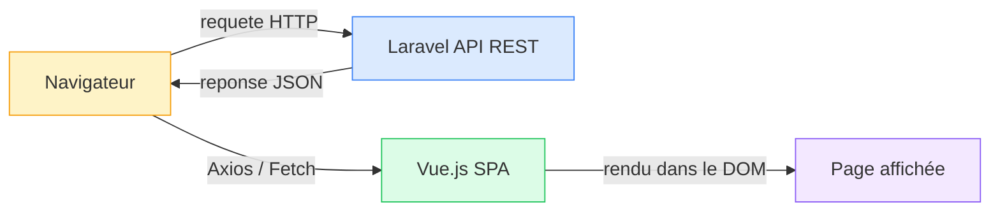

**Problèmes de cette approche classique :**
- Il faut coder une API REST complète côté Laravel (contrôleurs, routes API, transformers)
- Il faut gérer les requêtes Axios/Fetch côté Vue (loading, erreurs, retry)
- Il faut gérer le routeur Vue Router séparément
- Il faut synchroniser l'authentification entre les deux mondes
- C'est beaucoup de code "plomberie" qui n'apporte rien au métier

### La solution Inertia

Avec Inertia.js, **le routeur est celui de Laravel**. Vue.js ne gère pas ses propres routes. Voici comment ça marche :

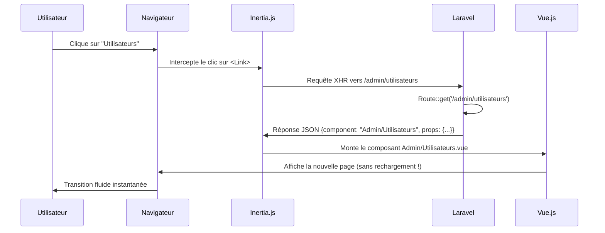

### Concrètement dans le code

**Côté Laravel** (`routes/web.php`) :
```php
Route::get('/admin/utilisateurs', function () {
    return Inertia::render('Admin/Utilisateurs');
    // 'Admin/Utilisateurs' correspond au fichier :
    // resources/js/Pages/Admin/Utilisateurs.vue
});
```

**Côté Vue.js** (dans le `Sidebar.vue` par exemple) :
```html
<Link :href="getRoute('/admin/utilisateurs')">
    Utilisateurs
</Link>
```

Le composant `<Link>` d'Inertia remplace la balise `<a>` classique. Quand on clique dessus :
1. Inertia **empêche le rechargement** de la page
2. Il fait une **requête AJAX** en arrière-plan vers Laravel
3. Laravel lui renvoie le **nom du composant Vue** à afficher + les **données** (props)
4. Inertia **remplace** le contenu de la page par le nouveau composant
5. L'URL du navigateur est **mise à jour** (grâce à l'API History)

**Résultat :** L'utilisateur a l'impression d'être sur une application mobile ultra-fluide.

---

## 3. Architecture globale du projet

### Schéma d'architecture complète

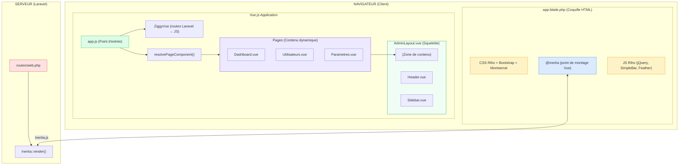

### Explication du schéma

1. **Le navigateur** charge `app.blade.php` une seule fois (premier chargement)
2. Ce fichier Blade inclut tous les CSS du thème Riho, la police Montserrat, et les JS (jQuery, Bootstrap, SimpleBar)
3. La directive `@inertia` crée un `<div id="app">` où Vue.js va se monter
4. `app.js` est le point d'entrée : il initialise Vue, Inertia et Ziggy
5. Ensuite, **tout se passe dans Vue.js** : les pages changent sans rechargement

---

## 4. Le cycle de vie d'une requête

Voici ce qui se passe exactement quand un utilisateur navigue dans l'application :

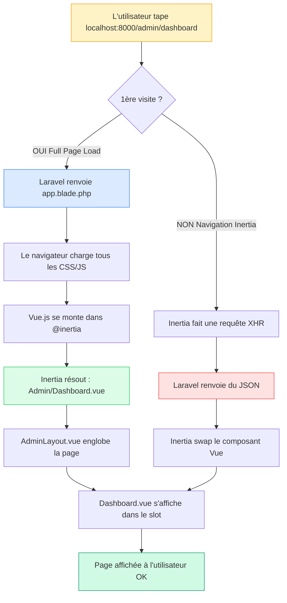

**Point clé :** La première visite charge tout (HTML complet). Toutes les navigations suivantes sont des **requêtes XHR légères** qui ne rechargent que le composant Vue.

---

## 5. Structure des fichiers détaillée

```
mangasa 2/
├── app/                          # Code PHP Laravel
│   └── Http/
│       └── Controllers/
│           └── ProfileController.php  # Contrôleur de profil (auth Breeze)
│
├── config/
│   └── app.php                   # Configuration générale (nom, timezone, locale)
│
├── public/
│   └── assets/                   # Assets du thème Riho
│       ├── css/
│       │   ├── bootstrap.css     # Framework CSS Bootstrap 5
│       │   ├── style.css         # Styles principaux du thème Riho
│       │   ├── color-1.css       # Palette de couleurs du thème
│       │   └── responsive.css    # Media queries responsive
│       └── js/
│           ├── jquery.min.js     # jQuery (requis par le thème)
│           ├── script.js         # Script principal Riho
│           ├── sidebar-menu.js   # Logique du menu latéral
│           └── sidebar-pin.js    # Logique des épingles du menu
│
├── resources/
│   ├── views/
│   │   └── app.blade.php         # 🔑 LE FICHIER BLADE UNIQUE (coquille HTML)
│   │
│   └── js/
│       ├── app.js                # 🔑 Point d'entrée JavaScript
│       ├── bootstrap.js          # Configuration Axios
│       │
│       ├── Layouts/              # ── SQUELETTES DE PAGE ──
│       │   └── AdminLayout.vue   # Layout principal (Header + Sidebar + Slot)
│       │
│       ├── Components/           # ── COMPOSANTS RÉUTILISABLES ──
│       │   ├── Admin/
│       │   │   ├── Sidebar.vue   # ✨ Menu latéral avec catégories et épingles
│       │   │   └── Header.vue    # ✨ Barre supérieure avec recherche et notifs
│       │   │
│       │   ├── Checkbox.vue      # Composant checkbox (Breeze)
│       │   ├── Dropdown.vue      # Composant dropdown générique (Breeze)
│       │   ├── Modal.vue         # Composant modale générique (Breeze)
│       │   ├── TextInput.vue     # Composant input texte (Breeze)
│       │   ├── InputLabel.vue    # Composant label de formulaire (Breeze)
│       │   ├── InputError.vue    # Composant message d'erreur (Breeze)
│       │   ├── NavLink.vue       # Composant lien de navigation (Breeze)
│       │   ├── PrimaryButton.vue # Bouton principal (Breeze)
│       │   └── ...               # Autres composants Breeze
│       │
│       └── Pages/                # ── PAGES (1 fichier = 1 URL) ──
│           ├── Admin/
│           │   ├── Dashboard.vue     # ✨ Tableau de bord principal
│           │   ├── Utilisateurs.vue  # ✨ Gestion des utilisateurs + accès
│           │   └── Parametres.vue    # ✨ Gestion des 15 tables de référence
│           │
│           ├── Auth/
│           │   ├── Login.vue         # Page de connexion
│           │   ├── Register.vue      # Page d'inscription
│           │   ├── ForgotPassword.vue # Mot de passe oublié
│           │   └── ...
│           │
│           ├── Dashboard.vue         # Dashboard utilisateur normal (Breeze)
│           └── Welcome.vue           # Page d'accueil Laravel
│
├── routes/
│   ├── web.php                   # 🔑 TOUTES LES ROUTES DE L'APPLICATION
│   └── auth.php                  # Routes d'authentification (Breeze)
│
├── vite.config.js                # Configuration Vite (bundler)
├── package.json                  # Dépendances JavaScript
└── composer.json                 # Dépendances PHP
```

> 💡 **Les fichiers marqués ✨ sont ceux que nous avons créés/modifiés.** Les fichiers marqués "(Breeze)" ont été générés automatiquement par le starter kit Laravel Breeze.

---

## 6. Le Layout System – Comment les pages sont assemblées

### Le principe du `<slot />`

Vue.js utilise un système de **slots** pour composer les pages. C'est comme un cadre photo : le cadre (Layout) est toujours le même, mais la photo (Page) change.

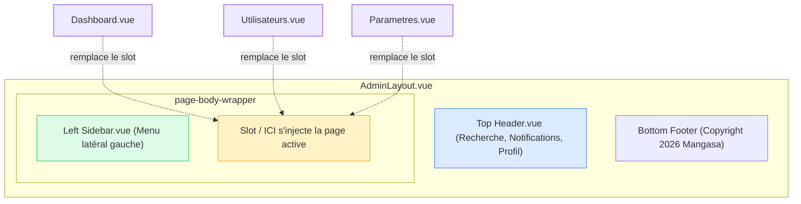

### Comment une page déclare son layout

Chaque page dit à Inertia quel layout utiliser avec une seule ligne :

```javascript
// Dans Dashboard.vue, Utilisateurs.vue, Parametres.vue
import AdminLayout from '@/Layouts/AdminLayout.vue';

defineOptions({ layout: AdminLayout });
```

Cette instruction dit : *"Quand tu m'affiches, englobe-moi dans AdminLayout.vue"*. Inertia s'occupe du reste automatiquement.

### Le code réel de AdminLayout.vue (simplifié)

```html
<template>
    <div class="page-wrapper compact-wrapper">
        <!-- Barre supérieure -->
        <Header @toggle-sidebar="toggleSidebar" />

        <div class="page-body-wrapper">
            <!-- Menu latéral -->
            <Sidebar :is-open="sidebarOpen" />

            <!-- 🔑 C'est ICI que chaque page s'affiche -->
            <div class="page-body">
                <slot />
            </div>

            <!-- Pied de page -->
            <footer>Copyright 2026 © Mangasa - EMASE</footer>
        </div>
    </div>
</template>
```

---

## 7. Les Composants créés en détail

### A. `Sidebar.vue` – Le menu latéral intelligent

**Fichier :** `resources/js/Components/Admin/Sidebar.vue` (292 lignes)

C'est le composant le plus complexe du projet. Voici ses fonctionnalités :

#### Structure des données du menu

Le menu est défini comme un tableau JavaScript avec deux types d'éléments :

```javascript
const menuItems = [
    // 👉 Type 1 : Catégorie (simple titre de section)
    { type: 'category', label: 'GÉNÉRAL' },
    
    // 👉 Type 2 : Item de menu (lien cliquable)
    {
        label: 'Dashboard',
        icon: 'bi bi-grid-fill',
        route: '/admin/dashboard',
    },
    
    // 👉 Type 3 : Item avec sous-menu (accordéon)
    {
        label: 'Comptabilité',
        icon: 'bi bi-wallet2',
        route: '#',
        children: [
            { label: 'Facturation', route: '/admin/comptabilite/facturation' },
            { label: 'Caisse', route: '/admin/comptabilite/caisse' },
        ]
    },
];
```

#### Catégories du menu

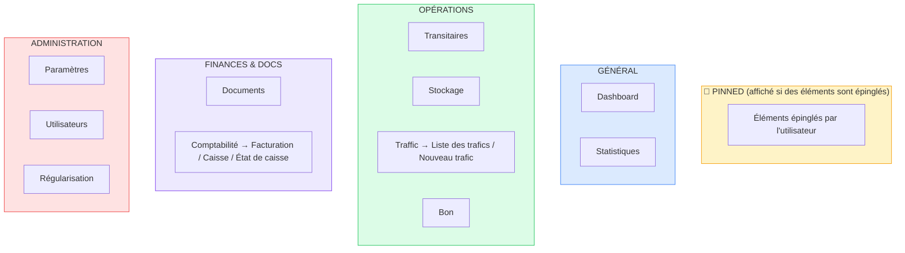

#### Système d'épingles (Pin)

Le Sidebar inclut un mécanisme d'épingle permettant à l'utilisateur de "favoriser" certains éléments du menu. Voici le flux :

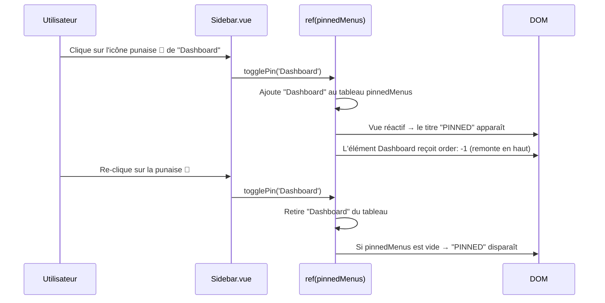

#### Détection de la page active

```javascript
const isActive = (item) => {
    // Vérifie si l'URL actuelle commence par la route de l'élément
    if (item.route && item.route !== '#') {
        return currentUrl.value.startsWith(item.route);
    }
    // Pour les sous-menus : vérifie chaque enfant
    if (item.children) {
        return item.children.some(child => 
            currentUrl.value.startsWith(child.route)
        );
    }
    return false;
};
```

### B. `Header.vue` – La barre supérieure

**Fichier :** `resources/js/Components/Admin/Header.vue` (145 lignes)

```mermaid
graph LR
    subgraph Header.vue
        LOGO["🏠 Logo Mangasa"]
        TOGGLE["☰ Toggle Sidebar"]
        SEARCH["🔍 Barre de recherche"]
        NOTIF["🔔 Notifications (badge: 3)"]
        PROFILE["👤 Alex Mora - Administrateur"]
    end
    
    TOGGLE -->|@click| EMIT["$emit toggle-sidebar"]
    EMIT -->|remonte au parent| LAYOUT["AdminLayout.vue"]
    LAYOUT -->|is-open| SIDEBAR["Sidebar.vue"]
    
    style Header.vue fill:#dbeafe,stroke:#3b82f6
    style EMIT fill:#fef3c7,stroke:#f59e0b
```

**Communication événementielle :**
- Quand on clique sur le bouton hamburger ☰ : `Header` émet un événement `toggle-sidebar`
- `AdminLayout.vue` reçoit cet événement et inverse la valeur de `sidebarOpen`
- Cette valeur est passée en prop (`:is-open`) au `Sidebar.vue`
- Le `Sidebar` adapte sa largeur en conséquence

C'est le **pattern événementiel de Vue.js** : les enfants communiquent vers le parent avec `$emit`, le parent communique vers les enfants avec les `props`.

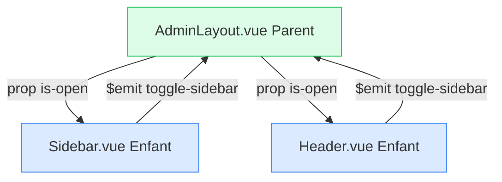

---

## 8. Les Pages créées en détail

### A. `Dashboard.vue` – Le tableau de bord

**Fichier :** `resources/js/Pages/Admin/Dashboard.vue` (308 lignes)

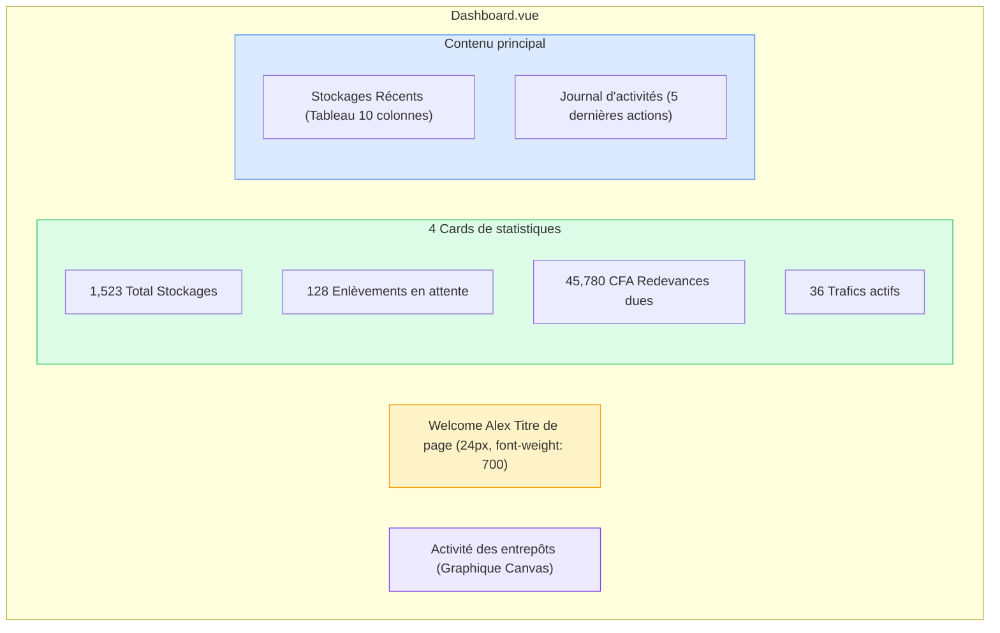

**Particularités techniques :**
- Le graphique est dessiné **manuellement** avec l'API Canvas 2D de JavaScript (pas de librairie externe comme Chart.js)
- Les données sont en `ref()` réactif → si elles changent, l'interface se met à jour automatiquement
- Le Canvas est initialisé dans le hook `onMounted()` (quand le DOM est prêt)

### B. `Utilisateurs.vue` – Gestion des comptes

**Fichier :** `resources/js/Pages/Admin/Utilisateurs.vue` (~500 lignes)

C'est la page la plus riche en interactions. Elle contient **3 modales** :

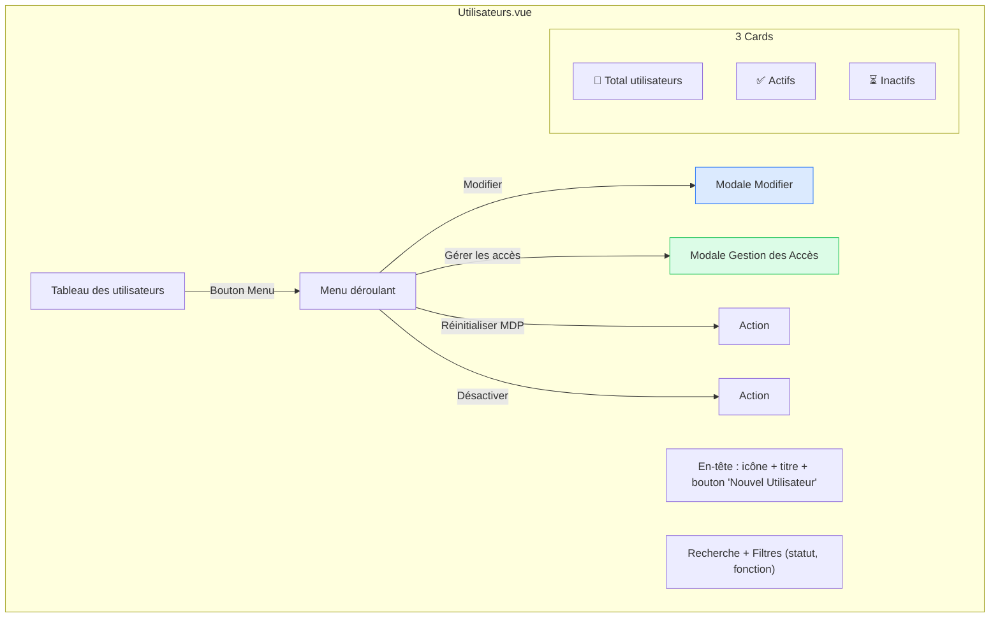

#### La modale "Gestion des Accès" (fonctionnalité clé)

Cette modale permet à l'administrateur de définir les permissions d'un utilisateur. Elle offre deux méthodes :

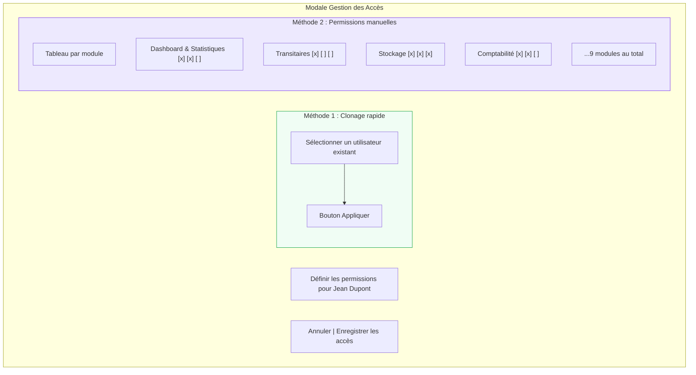

**Les colonnes de permissions :**

| Module | LECTURE | ÉCRITURE | SUPPRESSION |
|--------|---------|----------|-------------|
| Dashboard & Statistiques | ☑️ | ☑️ | ☐ |
| Transitaires | ☑️ | ☐ | ☐ |
| Stockage | ☑️ | ☑️ | ☑️ |
| Trafic | ☑️ | ☑️ | ☐ |
| Bons | ☑️ | ☐ | ☐ |
| Documents | ☑️ | ☑️ | ☐ |
| Comptabilité & Facturation | ☑️ | ☑️ | ☐ |
| Paramètres Généraux | ☑️ | ☑️ | ☑️ |
| Gestion des Utilisateurs | ☑️ | ☑️ | ☑️ |

#### Fonctionnalités de la page Utilisateurs

| Fonctionnalité | Technique Vue.js utilisée |
|----------------|--------------------------|
| Recherche en temps réel | `v-model` + `computed` filtré |
| Filtre par statut | `v-model` sur `<select>` |
| Filtre par fonction | `v-model` sur `<select>` |
| Pagination | `computed` + `slice()` |
| Avatar avec initiales | Fonction `getInitials()` + couleur aléatoire |
| Menu contextuel (⋯) | `v-if` conditionnel |
| Modales | `v-if` + `ref(showModal)` |
| Comptage dynamique | `computed` properties |

### C. `Parametres.vue` – Les tables de référence

**Fichier :** `resources/js/Pages/Admin/Parametres.vue` (184 lignes)

Au lieu de créer 15 pages distinctes, cette page gère tout dans une interface à onglets :

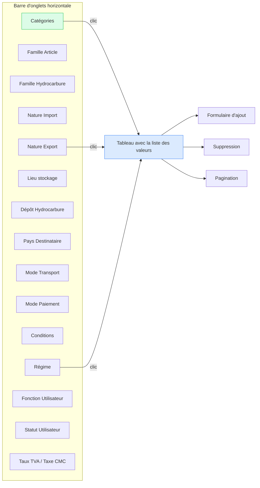

**Les 15 tables de paramétrage :**

| # | Table | Icône | Exemples de données |
|---|-------|-------|---------------------|
| 1 | Catégories | `bi-layers` | Engrais, Céréales, Farines, Véhicules, Divers |
| 2 | Famille Article | `bi-tag` | ~3851 articles |
| 3 | Famille Hydrocarbure | `bi-droplet` | Gasoil, Super, Jet A1, FO 180, Gaz, Bitume |
| 4 | Nature Import | `bi-box-arrow-in-down` | Maïs, Riz, Blé, Sucre, Ciment, Véhicules... (46 valeurs) |
| 5 | Nature Export | `bi-box-arrow-up` | Bovin, Coton, Céréales, Ferrailles... (26 valeurs) |
| 6 | Lieu de stockage | `bi-building` | Mole 1 à Mole 10, Kaolack |
| 7 | Dépôt Hydrocarbure | `bi-fuel-pump` | Sen Stock, Vivo Energy, DOT, Oryx, Shell... |
| 8 | Pays Destinataire | `bi-globe` | Mali, Burkina Faso, Niger, Ghana, Côte d'Ivoire... |
| 9 | Mode Transport | `bi-truck` | Route, Fer |
| 10 | Mode Paiement | `bi-credit-card` | Chèque, Virement, Espèce |
| 11 | Conditions | `bi-calendar3` | 15 jours, 30 jours, 45 jours... Fin mois |
| 12 | Régime | `bi-shield-check` | E100, E930, R100, R120, R400, S110, LTA, TIF... |
| 13 | Fonction Utilisateur | `bi-person-badge` | Gérant, Facturation, Caisse, Comptabilité, CMC... |
| 14 | Statut Utilisateur | `bi-person-check` | Simple, Validateur, Superviseur, Administrateur |
| 15 | Taux TVA / Taxe CMC | `bi-percent` | 18%, 0% / Engin, Conteneur 20p, 40p |

**Technique clé :** Le `computed` property `activeTable` lit l'onglet sélectionné et renvoie les données correspondantes instantanément, sans aucune requête serveur :

```javascript
const activeTableId = ref('categorie');
const activeTable = computed(() => 
    tables.value.find(t => t.id === activeTableId.value)
);
```

---

## 9. Les Routes – Backend et Frontend

### Routes Backend (Laravel)

Définies dans `routes/web.php` :

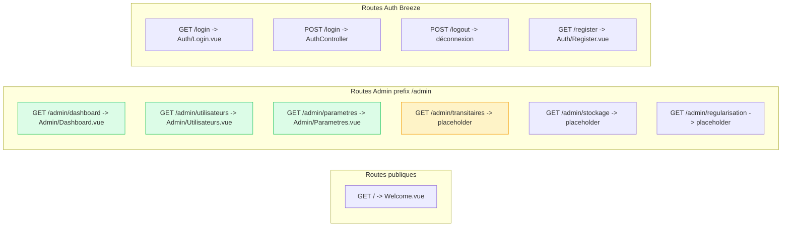

### Correspondance Routes → Pages Vue

| Route URL | Nom Laravel | Page Vue chargée | Statut |
|-----------|-------------|-----------------|--------|
| `/` | – | `Welcome.vue` | ✅ Fonctionnel |
| `/admin/dashboard` | `admin.dashboard` | `Admin/Dashboard.vue` | ✅ Fonctionnel |
| `/admin/utilisateurs` | `admin.utilisateurs` | `Admin/Utilisateurs.vue` | ✅ Fonctionnel |
| `/admin/parametres` | `admin.parametres` | `Admin/Parametres.vue` | ✅ Fonctionnel |
| `/admin/transitaires` | `admin.transitaires` | Placeholder (Dashboard) | ⏳ À faire |
| `/admin/stockage` | `admin.stockage` | Placeholder (Dashboard) | ⏳ À faire |
| `/admin/regularisation` | `admin.regularisation` | Placeholder (Dashboard) | ⏳ À faire |
| `/login` | `login` | `Auth/Login.vue` | ✅ Breeze |
| `/register` | `register` | `Auth/Register.vue` | ✅ Breeze |

---

## 10. Le Design System (Typographie)

Toute l'application respecte un système typographique strict pour garantir une cohérence visuelle :

| Rôle | Taille | Poids | Couleur | Utilisation |
|------|--------|-------|---------|-------------|
| **Titre de page** | `24px` | `700` (bold) | `#111827` | H1 page principale ("Welcome Alex 👋") |
| **Titre de section** | `15-16px` | `600-700` (semibold/bold) | `#4b5563` | H2, titres de cartes ("Stockages Récents") |
| **En-tête de carte** | `15px` | `600` (semibold) | `#4b5563` | card-header, titres de sections |
| **Valeur importante** | `20px` | `700` (bold) | `#212529` | Chiffres clés (1,523 ; 45,780 CFA) |
| **Corps standard** | `13px` | `400-500` | `#6b7280` | Cellules tableau, descriptions |
| **Texte secondaire** | `12px` | `400` | `#9ca3af` | Dates, métadonnées, timestamps |
| **Label formulaire** | `11px` | `600` | `#6b7280` | En-têtes de tableau (UPPERCASE) |
| **Référence / Code** | `13px` | `500` + `monospace` | `#0d9488` | N° dossier (2026/11/234) |

### Palette de couleurs

| Couleur | Hex | Utilisation |
|---------|-----|-------------|
| 🟩 Vert Mangasa | `#1a8a7d` | Couleur principale, boutons, liens actifs |
| ⬛ Noir texte | `#111827` | Titres, texte principal |
| 🔘 Gris moyen | `#6b7280` | Corps de texte secondaire |
| ⚪ Gris clair | `#9ca3af` | Métadonnées, timestamps |
| 🟫 Bordure | `#eaecf0` | Séparateurs, bordures de cartes |
| 🔴 Rouge danger | `#ef4444` | Boutons supprimer, alertes |
| 🟢 Vert succès | `#22c55e` | Badges actif, statut OK |
| 🟡 Jaune warning | `#f59e0b` | Badges inactif, icônes attention |

---

## 11. Intégration du thème Riho

### Le défi

Le thème **Riho** est un thème HTML/CSS/jQuery traditionnel. Il n'est PAS conçu pour Vue.js. L'intégrer a posé plusieurs défis :

| Problème | Solution appliquée |
|----------|-------------------|
| Les scripts jQuery du thème manipulent le DOM directement, ce qui entre en conflit avec Vue.js qui gère son propre DOM virtuel | Nous avons réécrit les parties critiques (menu, sidebar) en composants Vue.js purs, et nous gardons jQuery uniquement pour les fonctions non-critiques |
| Le script `sidebar-menu.js` cache/montre des éléments avec `display:none` en JavaScript | Nous avons utilisé des règles CSS avec `!important` pour forcer l'affichage |
| Le script `sidebar-pin.js` gère les épingles en jQuery | Nous avons recodé le système de pin entièrement en Vue.js réactif |
| Le thème ajoute des marges/paddings invisibles qui créent des espaces vides | Nous avons écrasé ces styles dans `AdminLayout.vue` et `Sidebar.vue` avec `margin: 0 !important` |
| Les icônes Feather ne se réinitialisent pas après une navigation Inertia | Nous appelons `feather.replace()` dans le hook `onMounted()` de chaque layout |

### Comment le thème est chargé

Le fichier `app.blade.php` charge les assets du thème :

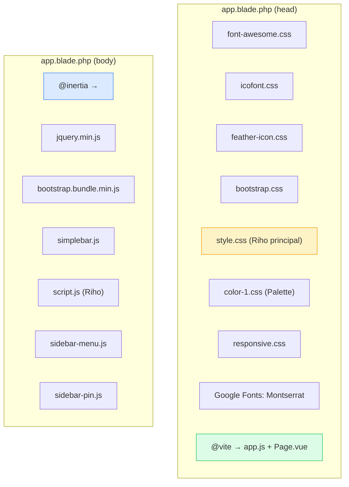

---

## 12. Commandes pour lancer le projet

### Installation initiale

```bash
# 1. Installer les dépendances PHP
composer install

# 2. Installer les dépendances JavaScript
npm install

# 3. Copier le fichier d'environnement
cp .env.example .env

# 4. Générer la clé d'application
php artisan key:generate

# 5. Configurer la base de données dans .env
# DB_DATABASE=mangasa
# DB_USERNAME=root
# DB_PASSWORD=
```

### Lancer le développement (2 terminaux nécessaires)

```bash
# Terminal 1 : Serveur PHP Laravel
php artisan serve
# → L'application tourne sur http://localhost:8000

# Terminal 2 : Serveur Vite (compilation temps réel)
npm run dev
# → Vite compile les fichiers .vue et recharge le navigateur automatiquement
```

### Accéder à l'application

| URL | Page |
|-----|------|
| `http://localhost:8000` | Page d'accueil |
| `http://localhost:8000/admin/dashboard` | Tableau de bord |
| `http://localhost:8000/admin/utilisateurs` | Gestion utilisateurs |
| `http://localhost:8000/admin/parametres` | Paramètres généraux |
| `http://localhost:8000/login` | Connexion |

---

## 13. Glossaire

| Terme | Définition |
|-------|------------|
| **SPA** | Single Page Application – Application web qui ne recharge jamais la page complète |
| **Composant** | Bloc de code Vue.js réutilisable (fichier `.vue`) contenant HTML, CSS et JavaScript |
| **Props** | Données passées d'un composant parent vers un composant enfant |
| **Emit** | Mécanisme pour qu'un enfant communique un événement vers son parent |
| **ref()** | Fonction Vue.js 3 qui crée une variable réactive (le DOM se met à jour automatiquement quand elle change) |
| **computed()** | Propriété calculée qui se recalcule automatiquement quand ses dépendances changent |
| **v-if** | Directive Vue.js pour afficher/masquer un élément selon une condition |
| **v-for** | Directive Vue.js pour boucler et afficher une liste d'éléments |
| **v-model** | Directive Vue.js pour lier un champ de formulaire à une variable (binding bidirectionnel) |
| **Slot** | Emplacement dans un composant parent où le contenu enfant sera injecté |
| **Layout** | Squelette de page qui contient les éléments communs (header, sidebar, footer) |
| **Inertia::render()** | Fonction Laravel qui dit "charge ce composant Vue avec ces données" |
| **Vite** | Outil de build moderne qui compile les fichiers Vue.js en JavaScript navigateur |
| **Ziggy** | Librairie qui rend les routes nommées Laravel accessibles en JavaScript |
| **Hot Reload** | Fonctionnalité de Vite : le navigateur se met à jour automatiquement quand on sauve un fichier |
| **XHR** | XMLHttpRequest – Requête HTTP faite en arrière-plan par JavaScript (sans recharger la page) |
| **Breeze** | Starter kit Laravel qui génère l'authentification (login, register, profil) avec Inertia + Vue |
